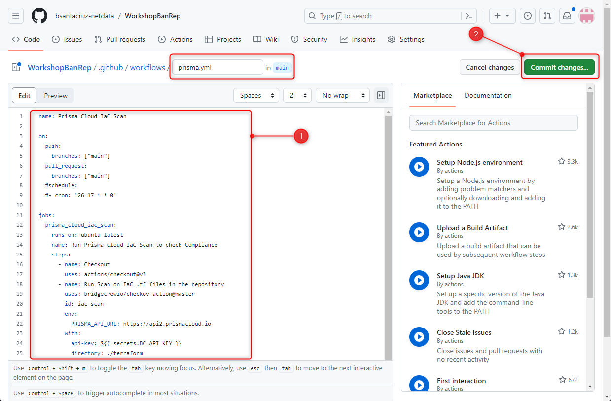

# WorkshopBanRep

Este repositorio contendrá todos los archivos relacionados al workshop de Prisma Cloud para Banco de La República.

# Code & Application Security

## Introducción

Prisma Cloud Code Security está pensado para asegurar desde una fase temprana el compliance en el código IaC, y evitar qué un error o no cumplimiento pueda traducirse en cientos de recursos con errores de configuraciones y/o vulnerabilidades en runtime. Actualmente soporta una amplia colección de recursos IaC cómo Dockerfile, manifiestos de Kubernetes, Helm Charts, Terraform, Terraform Plans, Cloudformation, Serverless, entre otros. Entre las principales integraciones se tienen:

1. Escaneo agentless en repositorios de IaC alojados en GitHub, Azure Repos, Bitbucket, entre otros.
2. Integración con herramientas CI/CD como AWS Code Build, Azure DevOps, GitHub Actions, Circle CI, Jenkins, entre otras.
3. Real Time Scanning en los IDE's de desarrollo VSC y JetBrains.

## Prerequisitos:

- Python instalado.
- VSC instalado.
- Git instalado en su laptop.
- Cuenta de GitHub.
- Usuario de Prisma Cloud.

## Analizando mis repositorios de IaC con Prisma Cloud

**Objetivo:** conectar un repositorio de GitHub que contenga templates/archivos de IaC a Prisma Cloud para poder detectar todos los hallazgos de incumplimiento y malas prácticas en Security as Code.

**Actividades:**

1. Hacerle un fork al repositorio ["CfnGoat"](https://github.com/bridgecrewio/cfngoat.git) dentro de su cuenta de GitHub.
   

2. Ingresar a Prisma Cloud con su usuario y contraseña asignado por Netdata.

   `Prisma Cloud URL: https://apps.paloaltonetworks.com/apps`

3. Integrar GitHub cómo Provider en Prisma Cloud, para ello seleccione las opciones: **Settings >> Code & Build Providers >> Code Repositories >> Add**
   
4. Seleccionar GitHub de la lista de Providers, dar click en **Previous - Configure Account** y luego en **Authorize**, seleccione únicamente el repositorio **CfnGoat** cómo el autorizado.
   
5. Al finalizar la autorización de acceso al repositorio, Prisma Cloud automáticamente detecta los incumplimientos de controles en IaC y muestra los hallazgos, estos resultados pueden ser consultados desde la opción: **Application Security >> Projects >> Overview** haciendo el filtro del repositorio adecuado.
   

<!-- ## Asegurando el cumplimiento en IaC con Prisma Cloud - Checkov

**Objetivo:** instalar el motor de escaneo de IaC **_Checkov_**

**Actividades:**

1. Para poder instalar Checkov previamente debe tener instalado Python >= 3.10, puede descargarlo en [este enlace](https://www.python.org/downloads/) y realizar su instalación por defecto.
2. Puede verificar la versión de Python instalado ejecutando el siguiente comando en su CLI:

```
python --version
```

3. Instalar Checkov, puede utilizar cualquiera de los dos comandos:

```
pip install checkov
pip3 install checkov
```

4. Descargue o clone el repositorio "xxxxx" en su maquina local.

5.

## Asegurando el cumplimiento en Tiempo Real desde el IDE

**Objetivo:** instalar la extensión de Checkov en Visual Studio Code.

**Actividades:**

1. Para poder instalar la extensión de Checkov, previamente debe tener instalado Visual Studio Code, puede descargarlo en [este enlace](https://code.visualstudio.com/download) y realizar su instalación por defecto.

2. Abrir Visual Studio Code e instalar la extensión de Checkov en la opción: **Extensiones**, **buscar “Checkov”** dar click en **instalar.**
   
-->

## Asegurando mi proceso de despliegue de IaC con GitHub Actions

**Objetivo:** Crear un pipeline en GitHub Actions con un Job de Prisma Cloud qué escanee por incumplimientos de controles en IaC.

**Actividades:**

1. Obtener una Access Key y Secret Key de Prisma Cloud, puede encontrar el [paso a paso para crearla en este enlace](https://docs.prismacloud.io/en/classic/cspm-admin-guide/manage-prisma-cloud-administrators/create-access-keys)

_`Nota: Asegúrese de establecer una expiración para la access key, esta es la buena práctica`_

2. Ir a Github y hacerle un fork a este repositorio en su cuenta de GitHub (mismos pasos que en el laboratorio anterior).

3. En su nuevo repositorio, seleccionar las siguientes opciones **Settings >> Secrets and variables >> Actions >> New repository secret** y crear las siguientes variables en GitHub:

- `Name: PRISMA_CLOUD_ACCESS_KEY`
- `Secret: Your_Prisma_Cloud_Access_Key_Value`

- `Name: PRISMA_CLOUD_SECRET_KEY`
- `Secret: Your_Prisma_Cloud_Secret_Key_Value`

  

_`Nota: Asegúrese de no incluir espacios en blanco en el secret`_

4. Configurar el Workflow de GitHub Actions para escanear los archivos de terraform del directorio `./terraform`, para ello seleccione **Actions >> Buscar Prisma Cloud >> Configure**
   

5. Reemplace todo el contenido del editor con el siguiente bloque de código y realice un **commit de los cambios en la rama main** Deje todo lo demás por defecto.

```
name: Prisma Cloud IaC Scan

on:
  push:
    branches: [ "main" ]
  pull_request:
    branches: [ "main" ]
  #schedule:
    #- cron: '26 17 * * 0'

jobs:
  prisma_cloud_iac_scan:
    runs-on: ubuntu-latest
    name: Run Prisma Cloud IaC Scan to check Compliance
    steps:
      - name: Checkout
        uses: actions/checkout@v3
      - name: Run Scan on IaC .tf files in the repository
        uses: prisma-cloud-shiftleft/iac-scan-action@v1
        id: iac-scan
        with:
          prisma_api_url: 'https://api.prismacloud.io'
          access_key: ${{ secrets.PRISMA_CLOUD_ACCESS_KEY }}
          secret_key: ${{ secrets.PRISMA_CLOUD_SECRET_KEY }}
          asset_name: 'my-repo-name'
          template_type: 'TF'
          template_version: 0.13
          #scan_path: './terraform'
          #failure_criteria: 'High:2,Medium:3,Low:5,Operator:or'
      - name: Upload scan result artifact
        uses: actions/upload-artifact@v2
        if: success() || failure()
        with:
          name: iac_scan_result
          path: ${{ steps.iac-scan.outputs.iac_scan_result_path }}
```



_`Nota: el código anterior también está disponible en el archivo ./workflow.yml en este repositorio`_

Toda la información para configuración de la tarea de escaneo IaC de Prisma puede encontrarla en [este enlace](https://github.com/prisma-cloud-shiftleft/iac-scan-action)

6. Realice un commit o push cualquiera dentro del repositorio, puede abrir el archivo `./README.md` y agregar al final del archivo una linea de texto cualquiera y realizar el commit de los cambios para disparar el Pipeline de escaneo de los archivos de terraform.
