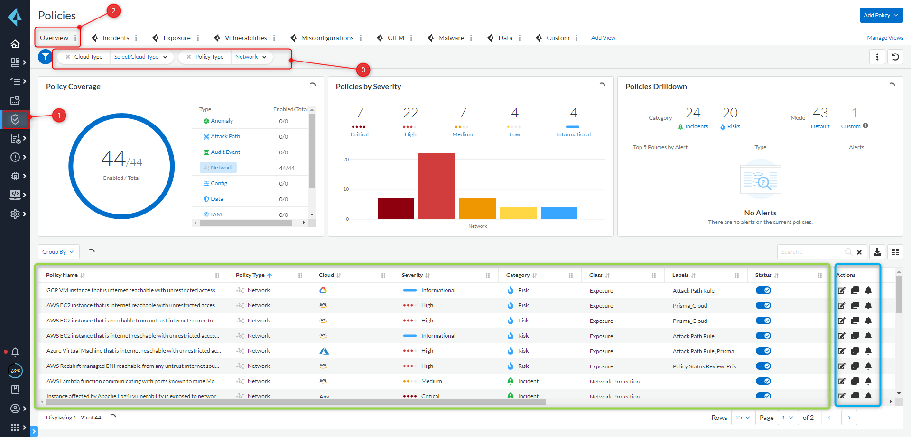

# WorkshopBanRep

Este repositorio contendrá todos los archivos relacionados al workshop de Prisma Cloud para Banco de La República.

# Cloud Secure Posture Management

## Introducción

El módulo CSPM (Cloud Secure Posture Management) de Prisma Cloud está enfocado en la postura y gobierno de las aplicaciones y recursos desplegados en la nube pública estableciendo controles de compliance en distintas categorías (config, network, anomaly, data) y basados en distintos benchmarks del mercado tipo CIS, NIST, GDPR, HIPAA, PCI, benchmarks de CSPs. Esto se logra a través de la ingesta de metadata desde Prisma Cloud hacia las cuentas de nube pública a través de sus API endpoints. Prisma Cloud almacena, procesa y correlaciona esta data a través de sus engines y de ML para presentar una postura global de seguridad de los recursos desplegados en la nube pública.

Actualmente son soportadas las 5 nubes públicas principales; AWS, Azure, GCP, OCI y Alibaba. Próximamente se estará incluyendo IBM Cloud.

Para este workshop nos enfocaremos principalmente en seguridad de la red cloud con Prisma Cloud, esto implica poder ingestar desde Prisma Cloud los AWS flow logs (logs de actividad de red en la VPC) un vistazo general a la arquitectura de funcionamiento de Prisma Cloud es:


## Prerequisitos:

- Cuenta de AWS funcional, puede crear una free tier desde [este enlace.](https://aws.amazon.com/resources/create-account/)

_`Nota: todas las actividades ejecutadas dentro de la cuenta de AWS están dentro del bundle Free Tier por lo que no incurrirá en costos para la ejecución de este Workshop.`_

## Datos a tener en cuenta:

- `Url de acceso a Prisma Cloud: https://apps.paloaltonetworks.com`
- `Usuario: su correo electrónico.`
- `Contraseña: su contraseña configurada.`
- `No olvide configurar su MFA, puede hacerlo con el mismo correo del usuario.`

## Habilitar AWS Flow Logs para Prisma Cloud:

**Objetivo:** Habilitar la visibilidad de los AWS flow logs para que Prisma Cloud pueda detectar exposición y anomalías en las conexiones.

**Actividades:**

1. Crear un Cloudwatch Log Group en AWS, para ello seleccione **Servicios >> Cloudwatch >> Logs >> Crear Log Group** Asigne el nombre de su preferencia.

   

2. Habilitar flow logs dentro de la AWS VPC, para ello seleccione **Servicios >> VPC >> Sus VPCs**

- **Seleccione su VPC (Default)** luego seleccione el botón **Acciones >> Crear Flow Log**

- Seleccione el filtro en **Todo**, el destino debe ser **Enviar a CloudWatch Logs,** busque y seleccione el Log Group creado en el punto 1.

- En una nueva ventada de AWS cree un Rol IAM para el envío de los Flow Logs a CloudWatch, puede encontrar un tutorial en [este enlace.](https://docs.aws.amazon.com/es_es/vpc/latest/userguide/flow-logs-cwl.html#flow-logs-iam-role)

- Avise al instructor una vez creado el rol para revisar este y asegurar qué la política de confianza se haya configurado de manera adecuada.

- En la ventana inicial de AWS, asigne el rol recién creado y de click en Crear Flow Log.
  

## Integración de cuenta de nube pública:

**Objetivo:** Integrar la cuenta de AWS a Prisma Cloud para realizar la ingesta de datos y a partir de allí revisar cual es el estado de la gobernanza de los recursos desplegados en la nube pública.

**Actividades:**

1. Integrar la cuenta de AWS, para ello inicie sesión dentro de Prisma Cloud, allí vamos a seleccionar la opción **Settings >> Cloud Accounts >> Add Cloud Account**
   

- A partir de allí seleccione: **AWS → Account → Desactive la opción "Agentless Workload Scanning" → Next**

  

- Ingrese el account ID de su cuenta AWS, [aquí un tutorial de cómo encontrarlo](https://docs.aws.amazon.com/es_es/accounts/latest/reference/manage-acct-identifiers.html), y un **nombre para la cuenta en Prisma Cloud.**

- Para crear los recursos necesarios en AWS seleccione el botón **Create IAM Role**, esto lo redirigirá a AWS en su navegador (vigencia del enlace: 1 hora)

  

- En AWS seleccione la casilla de verificación _I acknowledge that AWS CloudFormation might create IAM resources with custom names_ y luego de click en el botón "Crear"

- Una vez finalizada la creación de los recursos en AWS seleccione la opción **Outputs**, allí encuentra el ARL del rol IAM creado, **copie el valor**, regrese a Prisma Cloud y peguelo en el campo **IAM Role ARN**

- Dentro del Account Group seleccione **Workshop BanRep** y de click en **Next**

  

- Revise el status (puede que deba esperar unos segundos) y de click en **Save and Close**

  

## Controles de Network en Prisma Cloud:

Prisma cloud dispone de +1200 controles construidos qué son agrupados en +90 benchmarks de cumplimiento, entre ellos hay 44 controles para network. A partir de allí se puede robustecer tanto cómo se necesite y se requiera la gobernanza de la red en AWS a través de controles custom creados en Prisma Cloud.

**Objetivo:** Dar un breve vistazo a las políticas de red predefinidas en Prisma Cloud.

**Actividades:**

1. Revisar controles (políticas) de Prisma Cloud para el vector de ataque Network. Para ello vamos a Prisma Cloud, seleccionamos la opción **Policies >> Overview** y aplicamos los siguientes filtros: `Policy Type = Network` y `Cloud Type = AWS`

   

- En la parte de abajo encontrará las controles para los filtros seleccionados, preste especial atención a los campos `Description`, `Severity` y `Category` ellos indican: El detalle del control, y como catalogarlo si ocurre un incumplimiento.

- Del lado derecho tiene la columna **actions**, seleccione el icono del lápiz para cualquier control, allí podrá revisar con mayor detalle cada control.

_`Nota: Puede navegar por la interfaz tanto cómo desee para revisar los controles con detalle y entender cada uno de ellos.`_

## Real Time Network Revision con RQLs:

**Objetivo:** Conocer y revisar cuales son los hallazgos dentro de la red de mi nube pública

**Actividades:**

1. Entendiendo RQL (Resource Query Language): El motor RQL es el corazón del módulo CSPM de Prisma Cloud, en su mayoría, cada control (política) está atado a una query qué lo qué hace es buscar aquellos recursos qué hagan match y en consecuencia reportar el incumplimiento. El motor RQL es el encargado de interpretar y correr las queries de cada uno de los controles y por ende mantener actualizado el overview de la postura y gobierno en nube. Hay 3 tipos básicos de query en RQL: **Config, network & event.** Cada una de ellas enfocadas en detectar distintos tipos de brechas y/o vulnerabilidades en la nube pública.

Para el caso específico de Network, Prisma Cloud cuenta con 2 engines de análisis de datos de red, el primero es **Network Config Analyzer** encargado de asegurar la configuración de las redes en la nube pública. El segundo es **Network Flow Analyzer** encargado de analizar incidentes dentro de las redes en la nube pública.

## Visibilizando el incumplimiento:

# Code & Application Security

## Introducción

Prisma Cloud Code Security está pensado para asegurar desde una fase temprana el compliance en el código IaC, y evitar qué un error o no cumplimiento pueda traducirse en cientos de recursos con errores de configuraciones y/o vulnerabilidades en runtime. Actualmente soporta una amplia colección de recursos IaC cómo Dockerfile, manifiestos de Kubernetes, Helm Charts, Terraform, Terraform Plans, Cloudformation, Serverless, entre otros. Entre las principales integraciones se tienen:

1. Escaneo agentless en repositorios de IaC alojados en GitHub, Azure Repos, Bitbucket, entre otros.
2. Integración con herramientas CI/CD como AWS Code Build, Azure DevOps, GitHub Actions, Circle CI, Jenkins, entre otras.
3. Real Time Scanning en los IDE's de desarrollo VSC y JetBrains.

## Prerequisitos

- Python instalado.
- VSC instalado.
- Git instalado en su laptop.
- Cuenta de GitHub.
- Usuario de Prisma Cloud.

## Analizando mis repositorios de IaC con Prisma Cloud

**Objetivo:** conectar un repositorio de GitHub que contenga templates/archivos de IaC a Prisma Cloud para poder detectar todos los hallazgos de incumplimiento y malas prácticas en Security as Code.

**Actividades:**

1. Hacerle un fork al repositorio ["CfnGoat"](https://github.com/bridgecrewio/cfngoat.git) dentro de su cuenta de GitHub.
   

2. Ingresar a Prisma Cloud con su usuario y contraseña asignado por Netdata.

   `Prisma Cloud URL: https://apps.paloaltonetworks.com/apps`

3. Integrar GitHub cómo Provider en Prisma Cloud, para ello seleccione las opciones: **Settings >> Code & Build Providers >> Code Repositories >> Add**
   
4. Seleccionar GitHub de la lista de Providers, dar click en **Previous - Configure Account** y luego en **Authorize**, seleccione únicamente el repositorio **CfnGoat** cómo el autorizado.
   
5. Al finalizar la autorización de acceso al repositorio, Prisma Cloud automáticamente detecta los incumplimientos de controles en IaC y muestra los hallazgos, estos resultados pueden ser consultados desde la opción: **Application Security >> Projects >> Overview** haciendo el filtro del repositorio adecuado.
   

<!-- ## Asegurando el cumplimiento en IaC con Prisma Cloud - Checkov

**Objetivo:** instalar el motor de escaneo de IaC **_Checkov_**

**Actividades:**

1. Para poder instalar Checkov previamente debe tener instalado Python >= 3.10, puede descargarlo en [este enlace](https://www.python.org/downloads/) y realizar su instalación por defecto.
2. Puede verificar la versión de Python instalado ejecutando el siguiente comando en su CLI:

```
python --version
```

3. Instalar Checkov, puede utilizar cualquiera de los dos comandos:

```
pip install checkov
pip3 install checkov
```

4. Descargue o clone el repositorio "xxxxx" en su maquina local.

5.

## Asegurando el cumplimiento en Tiempo Real desde el IDE

**Objetivo:** instalar la extensión de Checkov en Visual Studio Code.

**Actividades:**

1. Para poder instalar la extensión de Checkov, previamente debe tener instalado Visual Studio Code, puede descargarlo en [este enlace](https://code.visualstudio.com/download) y realizar su instalación por defecto.

2. Abrir Visual Studio Code e instalar la extensión de Checkov en la opción: **Extensiones**, **buscar “Checkov”** dar click en **instalar.**
   
-->

## Asegurando mi proceso de despliegue de IaC con GitHub Actions

**Objetivo:** Crear un pipeline en GitHub Actions con un Job de Prisma Cloud qué escanee por incumplimientos de controles en IaC.

**Actividades:**

1. Obtener una Access Key y Secret Key de Prisma Cloud, puede encontrar el [paso a paso para crearla en este enlace](https://docs.prismacloud.io/en/classic/cspm-admin-guide/manage-prisma-cloud-administrators/create-access-keys)

_`Nota: Asegúrese de establecer una expiración para la access key, esta es la buena práctica`_

2. Ir a Github y hacerle un fork a este repositorio en su cuenta de GitHub (mismos pasos que en el laboratorio anterior).

3. En su nuevo repositorio, seleccionar las siguientes opciones **Settings >> Secrets and variables >> Actions >> New repository secret** y crear las siguientes variables en GitHub:

- `Name: BC_API_KEY `
- `Secret: AccessKey::SecretKey`

  

_`Nota: Asegúrese de no incluir espacios en blanco en el secret y de separar los dos valores por los caracteres "::"`_

4. Configurar el Workflow de GitHub Actions para escanear los archivos de terraform del directorio `./terraform`, para ello seleccione **Actions >> Buscar Prisma Cloud >> Configure**
   

5. Reemplace todo el contenido del editor con el siguiente bloque de código y realice un **commit de los cambios en la rama main** Deje todo lo demás por defecto.

```
name: Prisma Cloud IaC Scan

on:
  push:
    branches: ["main"]
  pull_request:
    branches: ["main"]
  #schedule:
  #- cron: '26 17 * * 0'

jobs:
  prisma_cloud_iac_scan:
    runs-on: ubuntu-latest
    name: Run Prisma Cloud IaC Scan to check Compliance
    steps:
      - name: Checkout
        uses: actions/checkout@v3
      - name: Run Scan on IaC .tf files in the repository
        uses: bridgecrewio/checkov-action@master
        id: iac-scan
        env:
          PRISMA_API_URL: https://api2.prismacloud.io
        with:
          api-key: ${{ secrets.BC_API_KEY }}
          directory: ./terraform
          framework: terraform
          quiet: true
          use_enforcement_rules: true
          #open_api_key: 'xxxxxx'

```


_`Nota: el código anterior también está disponible en el archivo ./workflow.yml en este repositorio`_

Toda la información para configuración de la tarea de escaneo IaC de Prisma puede encontrarla en [este enlace](https://github.com/bridgecrewio/checkov-action) y el command reference completo lo puede encontrar en [este enlace.](https://www.checkov.io/2.Basics/CLI%20Command%20Reference.html)

6. Realice un commit o push cualquiera dentro del repositorio, puede abrir el archivo `./README.md` y agregar al final del archivo una linea de texto cualquiera y realizar el commit de los cambios para disparar el Pipeline de escaneo de los archivos de terraform.

7. En cada evento push en el repositorio se va a correr la tarea de escaneo IaC de Prisma Cloud, si desea ver los resultados del escaneo, puede ir a **Actions y seleccionar el último workflow** Al final puede encontrar el enlace directo a Prisma Cloud para ver los hallazgos en Prisma Cloud, pero también los va a encontrar en el mismo output del CLI.
   

Made with Love :blue_heart: by Netdata Cloud & Automate Team.
